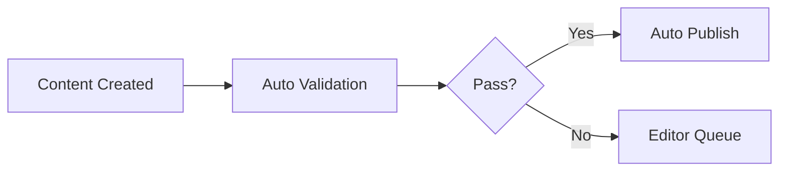

# Marketing & Editor User Guide

## Table of Contents
1. [Overview](#overview)
2. [Role-Based Access Guidelines](#role-based-access-guidelines)
3. [Content Workflows](#content-workflows)
4. [Content Approval Pipeline](#content-approval-pipeline)
5. [Performance Best Practices](#performance-best-practices)
6. [Quick Reference](#quick-reference)

---

## Overview

The Halcytone Content Generator is a comprehensive content management and distribution system designed to streamline content creation, approval, and multi-channel publication. This guide provides complete documentation for Marketing and Editorial teams.

### Key Features
- **Multi-channel Publishing**: Email, Web, Social Media (Twitter, LinkedIn, Instagram, Facebook)
- **Content Types**: Updates, Blog Posts, Announcements, Session Summaries
- **Tone Management**: Professional, Encouraging, Medical/Scientific
- **Automated Workflows**: Content generation, validation, and distribution
- **Real-time Updates**: WebSocket support for live session content

---

## Role-Based Access Guidelines

### Marketing Manager
**Access Level**: Full administrative access

**Permissions**:
- ✅ Create and edit all content types
- ✅ Approve content for publication
- ✅ Configure publishing schedules
- ✅ Access analytics and reporting
- ✅ Manage team member permissions
- ✅ Configure API integrations

**Primary Workflows**:
1. Campaign planning and execution
2. Content approval for high-priority items
3. Performance monitoring and optimization
4. Cross-channel coordination

**API Access**:
```bash
# Full access endpoints
POST /api/v2/generate-content
POST /api/v2/sync-content
POST /api/batch/generate
POST /api/cache/invalidate
GET /api/analytics/*
```

### Content Editor
**Access Level**: Content creation and editing

**Permissions**:
- ✅ Create and edit content
- ✅ Submit content for approval
- ✅ Preview content before publication
- ✅ Schedule content publication
- ❌ Cannot approve high-priority content
- ❌ Cannot modify system settings

**Primary Workflows**:
1. Content creation and refinement
2. Template selection and customization
3. SEO optimization
4. Content scheduling

**API Access**:
```bash
# Editor endpoints
POST /api/v2/generate-content (preview_only: true)
POST /api/v2/validate-content
GET /api/templates
GET /api/content/preview
```

### Social Media Manager
**Access Level**: Social media channels only

**Permissions**:
- ✅ Create and edit social media posts
- ✅ Schedule social media content
- ✅ View social analytics
- ✅ Manage platform-specific settings
- ❌ Cannot edit email or web content
- ❌ Cannot access CRM data

**Primary Workflows**:
1. Social media campaign management
2. Platform-specific content optimization
3. Engagement monitoring
4. Hashtag and trend management

**API Access**:
```bash
# Social-specific endpoints
POST /api/v2/generate-content (generate_social: true)
GET /api/social/analytics
POST /api/social/schedule
```

### Guest Contributor
**Access Level**: Limited content submission

**Permissions**:
- ✅ Submit draft content
- ✅ View own submissions
- ❌ Cannot publish directly
- ❌ Cannot access other content
- ❌ Cannot modify templates

**Primary Workflows**:
1. Blog post submission
2. Content revision based on feedback
3. Collaboration with editors

---

## Content Workflows

### 1. Weekly Update Workflow

**Schedule**: Every Tuesday at 10:00 AM EST

**Steps**:
1. **Content Collection** (Monday, 2:00 PM)
   - Fetch updates from Google Docs/Notion
   - Categorize content (Breathscape, Hardware, Tips, Vision)
   - Flag featured items

2. **Content Generation** (Monday, 4:00 PM)
   ```python
   POST /api/v2/generate-content
   {
     "send_email": true,
     "publish_web": true,
     "generate_social": true,
     "template_style": "weekly_update",
     "tone": "encouraging"
   }
   ```

3. **Review & Approval** (Tuesday, 9:00 AM)
   - Editor review for accuracy
   - Marketing approval for messaging
   - Legal review if needed

4. **Publication** (Tuesday, 10:00 AM)
   - Email blast via CRM
   - Website update
   - Social media posts

5. **Performance Monitoring** (Tuesday, 2:00 PM)
   - Open rates
   - Click-through rates
   - Social engagement

### 2. Blog Post Workflow

**Frequency**: 2-3 times per week

**Steps**:
1. **Topic Selection**
   - Research trending topics
   - Check content calendar
   - Validate SEO potential

2. **Content Creation**
   ```python
   POST /api/v2/generate-content
   {
     "content": {
       "type": "blog",
       "title": "The Science of Breathing",
       "category": "Science & Research",
       "target_keywords": ["coherent breathing", "HRV"]
     },
     "seo_optimize": true,
     "tone": "medical_scientific"
   }
   ```

3. **SEO Optimization**
   - Keyword density check
   - Meta description
   - Internal/external linking
   - Image alt text

4. **Editorial Review**
   - Fact-checking
   - Style guide compliance
   - Brand voice consistency

5. **Publication & Promotion**
   - Publish to website
   - Share on social media
   - Include in newsletter

### 3. Announcement Workflow

**Trigger**: Major updates or launches

**Steps**:
1. **Urgency Assessment**
   - Priority level (1-5)
   - Target audience
   - Required channels

2. **Content Preparation**
   ```python
   POST /api/v2/generate-content
   {
     "content": {
       "type": "announcement",
       "priority": 1,
       "featured": true,
       "urgency": "high"
     },
     "invalidate_cache": true
   }
   ```

3. **Rapid Approval** (< 2 hours)
   - Executive sign-off
   - Legal review if required

4. **Immediate Distribution**
   - Email blast
   - Website banner
   - Social media (all platforms)
   - Push notifications

### 4. Session Summary Workflow

**Trigger**: After each Halcytone Live session

**Steps**:
1. **Data Collection** (Real-time)
   ```python
   # WebSocket connection for live data
   ws://api/sessions/{session_id}/connect
   ```

2. **Automatic Summary Generation**
   - Participant metrics
   - HRV improvements
   - Key milestones
   - Instructor highlights

3. **Personalization**
   - Individual participant emails
   - Aggregate statistics
   - Achievement badges

4. **Distribution** (Within 1 hour)
   - Participant emails
   - Instructor dashboard
   - Community feed

---

## Content Approval Pipeline

### Level 1: Automatic Approval
**Content Types**:
- Regular blog posts
- Standard social media posts
- Weekly tips

**Criteria**:
- Passes all validation checks
- No sensitive content flags
- Author has publishing rights

**Process**:


### Level 2: Editor Approval
**Content Types**:
- Weekly updates
- Feature announcements
- Campaign content

**Criteria**:
- Requires brand consistency check
- May include external references
- Budget implications < $1,000

**Process**:
1. Content submission
2. Editor review (< 4 hours)
3. Revisions if needed
4. Editor approval
5. Scheduled publication

### Level 3: Marketing Approval
**Content Types**:
- Product launches
- Partnership announcements
- Major campaigns

**Criteria**:
- High visibility content
- Cross-channel coordination required
- Budget implications $1,000-$10,000

**Process**:
1. Draft creation
2. Editor review
3. Marketing manager review (< 24 hours)
4. Stakeholder feedback
5. Final approval
6. Coordinated release

### Level 4: Executive Approval
**Content Types**:
- Crisis communications
- Major strategic announcements
- Regulatory disclosures

**Criteria**:
- Company-wide impact
- Legal implications
- Budget implications > $10,000

**Process**:
1. Draft preparation with legal review
2. Department head review
3. Executive team review (< 48 hours)
4. Board notification if required
5. Controlled release with monitoring

---

## Performance Best Practices

### Content Generation Performance

#### Batch Processing Optimization
```python
# Optimal batch configuration
POST /api/batch/generate
{
  "batch_size": 10,  # Max 10 items per batch
  "parallel_processing": true,
  "timeout": 30000,  # 30 seconds
  "retry_on_failure": true,
  "max_retries": 3
}
```

**Performance Targets**:
- Single content item: < 500ms
- Batch (10 items): < 2 seconds
- Full weekly update: < 5 seconds

#### Caching Strategy
1. **Pre-cache frequent content**:
   - Templates
   - Common phrases
   - Author bios

2. **Cache invalidation**:
   ```python
   POST /api/cache/invalidate
   {
     "targets": ["cdn", "local", "api"],
     "patterns": ["/api/content/*", "/api/templates/*"],
     "max_age": 3600  # 1 hour
   }
   ```

3. **Cache warming**:
   - Run at 3 AM EST daily
   - Pre-generate common variations
   - Load frequently accessed content

### SEO Optimization

#### Content Structure
```markdown
# Primary Keyword in H1
Introduction paragraph with primary keyword in first 100 words.

## Secondary Keyword in H2
Supporting content with related keywords.

### Long-tail Keywords in H3
Detailed information targeting specific searches.
```

#### Meta Data Requirements
- **Title**: 50-60 characters
- **Description**: 150-160 characters
- **Keywords**: 5-10 relevant terms
- **Image Alt Text**: Descriptive, keyword-rich

#### Performance Metrics
- **Page Load Speed**: < 2 seconds
- **Time to First Byte**: < 500ms
- **Core Web Vitals**:
  - LCP: < 2.5s
  - FID: < 100ms
  - CLS: < 0.1

### Email Performance

#### Optimal Send Times
- **Tuesday**: 10 AM EST (highest open rates)
- **Thursday**: 2 PM EST (best click-through)
- **Avoid**: Mondays, Fridays after 3 PM

#### Subject Line Best Practices
- Length: 30-50 characters
- Personalization: Use {first_name}
- Urgency: Limited time offers
- Questions: Increase open rates by 15%

#### Email Template Performance
```html
<!-- Optimal structure -->
<table width="600" cellpadding="0" cellspacing="0">
  <!-- Preheader: 90-100 characters -->
  <!-- Hero image: 600x300px, < 100KB -->
  <!-- Main content: 150-200 words -->
  <!-- CTA button: Above the fold -->
  <!-- Footer: Unsubscribe, social links -->
</table>
```

### Social Media Performance

#### Platform-Specific Optimization

**Twitter/X**:
- Post length: 100-150 characters (higher engagement)
- Images: 1200x675px
- Best times: 9 AM, 12 PM, 5-6 PM EST
- Hashtags: 1-2 per post

**LinkedIn**:
- Post length: 150-300 characters
- Images: 1200x628px
- Best times: Tuesday-Thursday, 8-10 AM EST
- Hashtags: 3-5 professional tags

**Instagram**:
- Caption length: 125-150 characters visible
- Images: 1080x1080px (square)
- Best times: 11 AM-1 PM, 5 PM EST
- Hashtags: 10-15 in first comment

**Facebook**:
- Post length: 40-80 characters
- Images: 1200x630px
- Best times: 1-3 PM EST
- Videos: < 1 minute, subtitled

### Database Query Optimization

#### Indexing Strategy
```sql
-- Critical indexes for content queries
CREATE INDEX idx_content_type ON content(type);
CREATE INDEX idx_content_status ON content(status);
CREATE INDEX idx_content_published ON content(published_at);
CREATE INDEX idx_content_author ON content(author_id);
CREATE COMPOSITE INDEX idx_content_search
  ON content(type, status, published_at);
```

#### Query Performance Tips
1. Use pagination for large datasets
2. Implement cursor-based pagination for real-time feeds
3. Cache frequently accessed queries
4. Use database connection pooling
5. Implement query result caching

### API Performance

#### Rate Limiting
```python
# Recommended limits by role
rate_limits = {
    "admin": 1000,      # requests per minute
    "editor": 500,
    "contributor": 100,
    "guest": 50
}
```

#### Response Time Targets
- GET requests: < 200ms
- POST requests: < 500ms
- Batch operations: < 2s
- File uploads: < 5s

#### Monitoring Metrics
- Request latency (p50, p95, p99)
- Error rates by endpoint
- Database connection pool usage
- Cache hit rates
- CDN bandwidth usage

---

## Quick Reference

### Common API Endpoints

```bash
# Content Generation
POST /api/v2/generate-content
POST /api/v2/validate-content
POST /api/batch/generate

# Content Management
GET /api/content/{id}
PUT /api/content/{id}
DELETE /api/content/{id}

# Templates
GET /api/templates
GET /api/templates/{name}

# Analytics
GET /api/analytics/summary
GET /api/analytics/email
GET /api/analytics/social

# Cache Management
POST /api/cache/invalidate
GET /api/cache/status

# WebSocket (Live Sessions)
ws://api/sessions/{id}/connect
```

### Content Type Schemas

#### Update Content
```json
{
  "type": "update",
  "title": "Weekly Update",
  "content": "Main content...",
  "excerpt": "Brief summary",
  "channels": ["email", "web", "social"],
  "priority": 3,
  "tags": ["update", "weekly"]
}
```

#### Blog Content
```json
{
  "type": "blog",
  "title": "Blog Title",
  "content": "Full article...",
  "category": "Category Name",
  "author": "Author Name",
  "seo_description": "Meta description",
  "target_keywords": ["keyword1", "keyword2"],
  "featured_image": "image_url"
}
```

#### Announcement Content
```json
{
  "type": "announcement",
  "title": "Important Announcement",
  "content": "Announcement details...",
  "urgency": "high",
  "priority": 1,
  "featured": true,
  "call_to_action": "Learn More",
  "expiry_date": "2024-12-31T23:59:59Z"
}
```

### Keyboard Shortcuts

| Shortcut | Action |
|----------|--------|
| `Ctrl+N` | New content |
| `Ctrl+S` | Save draft |
| `Ctrl+P` | Preview |
| `Ctrl+Enter` | Publish |
| `Ctrl+D` | Duplicate |
| `Ctrl+/` | Show shortcuts |

### Status Codes

| Code | Meaning | Action |
|------|---------|--------|
| 200 | Success | Content processed |
| 201 | Created | New content created |
| 400 | Bad Request | Check input format |
| 401 | Unauthorized | Check API key |
| 403 | Forbidden | Insufficient permissions |
| 422 | Validation Failed | Fix content issues |
| 429 | Rate Limited | Wait and retry |
| 500 | Server Error | Contact support |

### Support Contacts

- **Technical Support**: tech-support@halcytone.com
- **Content Team**: content@halcytone.com
- **API Issues**: api-support@halcytone.com
- **Emergency**: +1-555-HALCYTONE (24/7)

---

## Appendix

### Glossary
- **HRV**: Heart Rate Variability
- **CRM**: Customer Relationship Management
- **SEO**: Search Engine Optimization
- **CTA**: Call to Action
- **API**: Application Programming Interface
- **CDN**: Content Delivery Network
- **LCP**: Largest Contentful Paint
- **FID**: First Input Delay
- **CLS**: Cumulative Layout Shift

### Version History
- v1.0 - Initial release (Sprint 5)
- v1.1 - Added performance best practices
- v1.2 - Enhanced role-based guidelines

---

*Last Updated: January 2025 | Sprint 5 - Cohesion & Polishing*