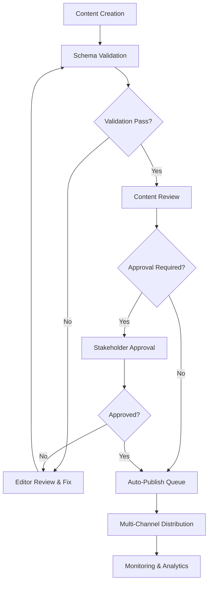

# Publishing Workflow Documentation
**Sprint 2: Blog & Content Integration**

Complete documentation of the content lifecycle from creation to multi-channel distribution.

## Table of Contents

1. [Overview](#overview)
2. [Content Creation Flow](#content-creation-flow)
3. [Review & Validation Process](#review--validation-process)
4. [Publishing Pipeline](#publishing-pipeline)
5. [Weekly Updates Process](#weekly-updates-process)
6. [Approval Pipeline](#approval-pipeline)
7. [Channel-Specific Workflows](#channel-specific-workflows)
8. [Monitoring & Analytics](#monitoring--analytics)
9. [Error Handling](#error-handling)

## Overview

The Halcytone Content Generator follows a structured workflow that ensures content quality, brand consistency, and optimal distribution across multiple channels. The system implements a **creation → review → publish** pipeline with comprehensive validation at each stage.

### Workflow Stages



## Content Creation Flow

### 1. Initial Content Creation

**Location**: Living Documents (Google Docs, Notion)
**Participants**: Content Editors, Marketing Team
**Tools**: Content Generator Schema Validation

#### Content Types & Templates

**Update Content** (Weekly Progress Reports)
```markdown
<!-- type: update -->
<!-- published: false -->
<!-- channels: email,web,social -->

## Update: [Title]
[Main content describing the update]

**Key Points:**
- Point 1
- Point 2
- Point 3

**What's Next:** [Future plans]
```

**Blog Content** (Educational, Thought Leadership)
```markdown
<!-- type: blog -->
<!-- category: [Breathing Techniques|Science & Research|Technology|Wellness] -->
<!-- published: false -->
<!-- seo_description: [120-160 character description] -->

# [Blog Title]

## Introduction
[Hook and overview]

## Main Content
[Detailed sections with subheadings]

## Conclusion
[Key takeaways and call-to-action]

**Tags**: #breathwork #wellness #mindfulness
```

**Announcement Content** (Major News, Launches)
```markdown
<!-- type: announcement -->
<!-- urgency: [low|medium|high|critical] -->
<!-- featured: true -->
<!-- published: false -->

# 🎉 ANNOUNCEMENT: [Title]

## The Big News
[Lead paragraph with key announcement]

## Details
[Comprehensive information]

## Impact
[How this affects users/community]

## What's Next
[Timeline and next steps]
```

#### Content Flags System

| Flag | Purpose | Values | Default |
|------|---------|--------|---------|
| `published` | Controls publication | `true/false` | `false` |
| `featured` | Priority placement | `true/false` | `false` |
| `channels` | Distribution channels | `email,web,social,preview` | `email,web,social` |
| `priority` | Content priority | `1-5` (1=urgent) | `3` |
| `scheduled_for` | Publication timing | ISO datetime | immediate |
| `dry_run` | Preview only | `true/false` | `false` |
| `template` | Override template | `modern,minimal,breathscape,announcement` | auto-detect |

### 2. Content Validation

**Automatic Validation via Schema System**

When content is created or modified, the system automatically:

1. **Detects Content Type** based on title, content patterns, and explicit flags
2. **Applies Validation Rules** using strict Pydantic v2 models
3. **Generates Warnings** for business rule violations
4. **Creates Enhanced Metadata** including SEO scores and recommendations

**Validation Checklist** (Automated)
- ✅ Title length (1-200 characters)
- ✅ Content minimum word count (varies by type)
- ✅ Required fields for content type
- ✅ SEO optimization (for web content)
- ✅ Platform-specific limits (for social content)
- ✅ Scheduling validation (future dates only)
- ✅ Channel compatibility

## Review & Validation Process

### 3. Editorial Review

**Responsibility**: Content Editors
**Tools**: Dry-run preview, validation reports
**Duration**: 30-60 minutes per content item

#### Review Checklist

**Content Quality**
- [ ] Brand voice and tone consistency
- [ ] Grammar and spelling accuracy
- [ ] Factual accuracy and citations
- [ ] Appropriate length for target channels
- [ ] Clear call-to-action (where applicable)

**Technical Validation**
- [ ] All validation rules passed
- [ ] SEO optimization complete (blogs/web)
- [ ] Channel-specific formatting correct
- [ ] Media assets properly linked
- [ ] Template selection appropriate

**Business Rules**
- [ ] Publication timing optimal
- [ ] Channel selection strategic
- [ ] Priority level appropriate
- [ ] Compliance with brand guidelines

#### Dry-Run Testing

Before final publication, editors must test content using dry-run mode:

```markdown
<!-- dry_run: true -->
<!-- published: true -->
<!-- channels: email,web,social -->

[Content here...]
```

**Dry-Run Outputs**:
- Email newsletter preview
- Web page preview with SEO analysis
- Social media post previews (all platforms)
- Validation warnings and recommendations

### 4. Content Enhancement

**Auto-Enhancement Features**:

- **Blog Posts**: Auto-calculate reading time, generate excerpt, SEO score
- **Web Content**: Auto-generate URL slug, optimize meta descriptions
- **Social Posts**: Platform-specific formatting, hashtag optimization
- **Newsletters**: Template selection, spam score analysis

**Manual Enhancement Options**:
- Custom template selection
- Advanced SEO optimization
- A/B testing variants
- Personalization rules

## Publishing Pipeline

### 5. Publication Queue

**Queue Types**:

1. **Immediate Publication** (`scheduled_for` not set)
2. **Scheduled Publication** (`scheduled_for` set to future date)
3. **Dry-Run Queue** (`dry_run: true`) - Preview only

#### Publication Process

```yaml
Publication Steps:
  1. Final Validation:
     - Schema validation
     - Business rules check
     - External service availability

  2. Content Generation:
     - Newsletter HTML/text generation
     - Web page creation with SEO
     - Social media posts per platform

  3. Multi-Channel Distribution:
     - Email via CRM API
     - Web via Platform API
     - Social via platform APIs

  4. Success Confirmation:
     - Delivery receipts collected
     - Error handling for failed channels
     - Analytics tracking initiated
```

### 6. Multi-Channel Distribution

#### Email Newsletter Distribution

**Channel**: CRM Integration
**Template Options**: Modern, Minimal, Breathscape, Plain
**Personalization**: Recipient segmentation, dynamic content

```yaml
Email Process:
  - Subject line optimization (10-100 chars)
  - HTML/text dual format
  - Deliverability validation
  - Bounce/engagement tracking
  - List segmentation support
```

#### Web Content Publishing

**Channel**: Platform API Integration
**SEO Features**: Meta tags, structured data, sitemap updates
**Content Types**: Blog posts, update pages, announcement pages

```yaml
Web Process:
  - URL slug generation
  - SEO meta tag creation
  - Image optimization
  - Internal linking suggestions
  - Search engine notifications
```

#### Social Media Distribution

**Platforms**: Twitter, LinkedIn, Facebook, Instagram
**Features**: Platform-specific formatting, optimal timing, hashtag optimization

```yaml
Social Process:
  - Platform character limits enforced
  - Hashtag optimization per platform
  - Image/media attachment
  - Engagement tracking setup
  - Cross-platform coordination
```

## Weekly Updates Process

### "Weekly Updates Posted to Updates Page" Workflow

**Schedule**: Every Tuesday at 10:00 AM EST
**Content Type**: Update
**Channels**: Email, Web, Social
**Template**: Modern or Breathscape

#### Weekly Update Creation Process

**Step 1: Content Preparation** (Monday)
```markdown
<!-- type: update -->
<!-- template: modern -->
<!-- published: false -->
<!-- scheduled_for: 2024-03-19T10:00:00Z -->
<!-- channels: email,web,social -->
<!-- featured: true -->

## Weekly Progress Update - March 19, 2024

This week we achieved significant milestones in our breathing technology development...

**Key Achievements:**
- Breathscape algorithm accuracy improved to 97%
- 10,000+ new users joined our wellness community
- Beta testing completed for hardware device

**Coming Next Week:**
- Public beta launch of Breathscape 2.0
- Partnership announcement with leading wellness clinics
- New breathing technique tutorials

**Community Highlights:**
[User stories and testimonials]
```

**Step 2: Review Process** (Monday Evening)
- Content team review for completeness
- Technical accuracy verification
- Brand voice consistency check
- SEO optimization review

**Step 3: Approval** (Tuesday Morning)
- Final stakeholder approval
- Last-minute updates if needed
- Dry-run test execution

**Step 4: Publication** (Tuesday 10 AM EST)
- Automatic multi-channel distribution
- Real-time monitoring of delivery
- Engagement tracking activation

#### Weekly Update Distribution Flow

```yaml
Email Distribution:
  - Subject: "Weekly Update: [Key Achievement]"
  - Recipient: All newsletter subscribers
  - Template: Breathscape (wellness-focused)
  - Personalization: User journey stage

Web Publication:
  - Location: /updates/weekly-[date]
  - Featured: Homepage banner for 48 hours
  - SEO: Optimized for "Halcytone updates" keywords
  - Social sharing: Auto-generated share buttons

Social Media:
  - Twitter: Thread format with key points
  - LinkedIn: Professional summary with metrics
  - Facebook: Community-focused with engagement questions
  - Instagram: Visual highlights with Stories
```

#### Success Metrics for Weekly Updates

- **Email**: >25% open rate, >5% click-through rate
- **Web**: >1000 unique page views within 7 days
- **Social**: >100 total engagements across platforms
- **SEO**: Featured in Google News for "breathing technology updates"

## Approval Pipeline

### Content Approval Matrix

| Content Type | Approval Required | Approvers | Timeline |
|--------------|-------------------|-----------|----------|
| **Standard Updates** | Editor Self-Approval | Content Editor | Immediate |
| **Blog Posts** | Editorial Review | Senior Editor | 24 hours |
| **Featured Content** | Marketing Approval | Marketing Lead | 48 hours |
| **Announcements** | Multi-Level Approval | Marketing + Executive | 72 hours |
| **Critical/Urgent** | Expedited Approval | Available Authority | 2 hours |

### Approval Workflow by Content Priority

#### Priority 1-2 (Urgent/High)
```yaml
Fast-Track Approval:
  1. Editor creates with dry_run: true
  2. Immediate escalation to team lead
  3. Parallel review by marketing team
  4. Executive approval (if announcement)
  5. Publication within 2 hours

Participants:
  - Content Editor (creation)
  - Team Lead (editorial approval)
  - Marketing Manager (brand approval)
  - Executive Team (final approval for major announcements)
```

#### Priority 3 (Normal)
```yaml
Standard Approval:
  1. Editor creates and self-reviews
  2. Dry-run testing and optimization
  3. Marketing team notification (featured content)
  4. Scheduled publication

Timeline: 24-48 hours
```

#### Priority 4-5 (Low/Archive)
```yaml
Minimal Approval:
  1. Editor self-approval
  2. Automated validation only
  3. Standard publication queue

Timeline: Immediate to 24 hours
```

### Approval Process Tools

**Review Dashboard Features**:
- Content queue with approval status
- Side-by-side preview comparison
- Validation report integration
- Comment and feedback system
- Approval workflow tracking

**Notification System**:
- Slack integration for approval requests
- Email notifications for stakeholders
- Mobile app alerts for urgent content
- Dashboard badges for pending items

### Approval Escalation Rules

**Automatic Escalation Triggers**:
- Validation failures not resolved within 4 hours
- Approval pending for >48 hours (normal priority)
- Approval pending for >2 hours (urgent priority)
- Multiple review cycles (>3 rounds)

**Escalation Chain**:
1. **Level 1**: Content Editor
2. **Level 2**: Senior Editor / Team Lead
3. **Level 3**: Marketing Manager
4. **Level 4**: Executive Team (CEO/CMO)

## Channel-Specific Workflows

### Email Newsletter Workflow

**Content Preparation**:
- Newsletter subject line optimization
- Template selection based on content type
- Personalization rules setup
- A/B testing configuration (if applicable)

**Distribution Process**:
- List segmentation based on user preferences
- Send time optimization per timezone
- Deliverability verification
- Bounce handling and list cleanup

**Post-Publication**:
- Open rate monitoring (first 24 hours)
- Click-through analysis
- Unsubscribe rate monitoring
- Performance comparison to benchmarks

### Web Content Workflow

**SEO Preparation**:
- Keyword research and optimization
- Meta description crafting
- Internal linking strategy
- Image alt-text optimization

**Publication Process**:
- URL structure optimization
- Sitemap update
- Search engine notification
- Social media meta tags setup

**Post-Publication**:
- Search ranking monitoring
- Page performance analytics
- User engagement tracking
- Content update recommendations

### Social Media Workflow

**Platform-Specific Optimization**:

**Twitter**:
- 280 character limit enforcement
- Thread creation for longer content
- Optimal hashtag usage (2 max)
- Engagement timing optimization

**LinkedIn**:
- Professional tone adaptation
- Industry-specific hashtags
- Native video preference
- Community engagement focus

**Facebook**:
- Community-building language
- Visual content emphasis
- Event tie-ins
- Local relevance optimization

**Instagram**:
- Visual-first approach
- Story highlights creation
- IGTV for longer content
- Influencer collaboration opportunities

## Monitoring & Analytics

### Real-Time Monitoring

**Publication Success Tracking**:
- Channel delivery confirmation
- Error rate monitoring
- Performance baseline comparison
- Audience engagement initiation

**Key Metrics Dashboard**:
- Content publication rate
- Multi-channel success rate
- Average approval time
- Validation failure rate

### Performance Analytics

**Content Performance Metrics**:

**Email**:
- Open rate (target: >25%)
- Click-through rate (target: >5%)
- Unsubscribe rate (limit: <1%)
- Spam complaint rate (limit: <0.1%)

**Web**:
- Unique page views (target: varies by type)
- Average time on page (target: >2 minutes)
- Bounce rate (limit: <60%)
- Search ranking improvements

**Social Media**:
- Total engagement rate (target: >5%)
- Share/retweet rate
- Comment sentiment analysis
- Follower growth attribution

### Weekly Reporting

**Content Performance Report** (Generated Fridays):
- Week-over-week performance comparison
- Channel effectiveness analysis
- Content type performance ranking
- Audience engagement trends
- Optimization recommendations

**Workflow Efficiency Report** (Generated Monthly):
- Average content creation time
- Approval pipeline efficiency
- Validation failure analysis
- Process improvement recommendations

## Error Handling

### Content Validation Failures

**Immediate Response**:
1. Editor notification via dashboard alert
2. Detailed validation report generation
3. Suggested fixes and optimizations
4. Revalidation workflow initiation

**Common Validation Issues**:
- Character limits exceeded (social media)
- Missing required SEO fields (web content)
- Spam trigger words (email subject lines)
- Scheduling conflicts or invalid dates
- Channel compatibility issues

### Publication Failures

**Channel-Specific Error Handling**:

**Email Delivery Failures**:
- Automatic retry with exponential backoff
- Alternative delivery route attempt
- Recipient list validation and cleanup
- Bounce categorization and handling

**Web Publishing Failures**:
- Content versioning and rollback capability
- Alternative CDN routing
- Database consistency checks
- SEO impact mitigation

**Social Media Posting Failures**:
- Platform-specific error code handling
- Automatic repost scheduling
- Content modification for platform compliance
- Manual intervention notification

### Recovery Procedures

**Failed Publication Recovery**:
1. **Assessment**: Determine failure scope and impact
2. **Communication**: Notify stakeholders and audience if needed
3. **Resolution**: Apply appropriate fix based on failure type
4. **Verification**: Confirm successful republication
5. **Analysis**: Document lesson learned and prevent recurrence

**Content Rollback Procedures**:
- Version control for all content
- One-click rollback capability
- Stakeholder notification system
- Impact assessment and mitigation

### Quality Assurance

**Continuous Improvement**:
- Monthly workflow review meetings
- Performance benchmark updates
- Process optimization based on analytics
- Team training on new features/tools

**Compliance Monitoring**:
- Brand guideline adherence tracking
- Legal/regulatory compliance verification
- Privacy policy compliance (GDPR, CCPA)
- Accessibility standard compliance (WCAG)

---

## Quick Reference

### Content Creation Checklist
- [ ] Content type selected and template applied
- [ ] Required fields completed
- [ ] Validation rules passed
- [ ] Channel selection optimized
- [ ] Scheduling configured
- [ ] Dry-run testing completed

### Publication Checklist
- [ ] Final approval obtained
- [ ] All channels configured
- [ ] Analytics tracking enabled
- [ ] Error handling prepared
- [ ] Success metrics defined
- [ ] Post-publication monitoring scheduled

### Weekly Update Quick Start
1. Use Update content type template
2. Set `featured: true` for homepage placement
3. Schedule for Tuesday 10 AM EST
4. Include key metrics and forward-looking content
5. Test with dry-run before final publication
6. Monitor performance for optimization insights

This workflow documentation ensures consistent, high-quality content delivery across all Halcytone communication channels while maintaining brand excellence and audience engagement.