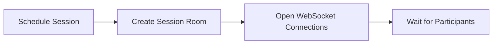
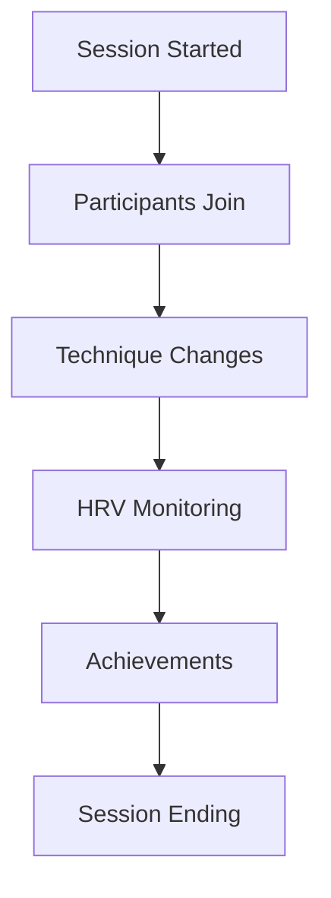
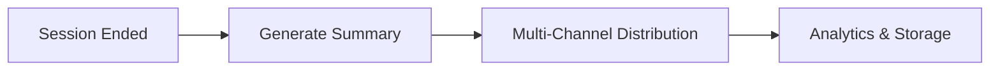
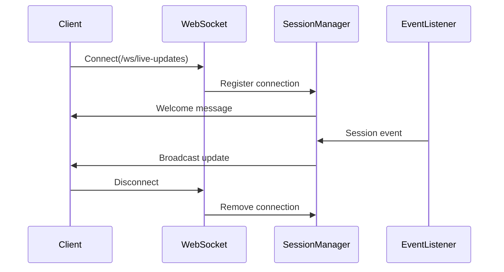

# Session Content Workflow Documentation
**Sprint 3: Halcytone Live Support**

Complete guide for creating, managing, and distributing breathing session content.

## Table of Contents

1. [Overview](#overview)
2. [Session Content Types](#session-content-types)
3. [Session Lifecycle](#session-lifecycle)
4. [Content Generation Pipeline](#content-generation-pipeline)
5. [Real-time Distribution](#real-time-distribution)
6. [API Usage](#api-usage)
7. [Best Practices](#best-practices)

## Overview

The Session Content system enables real-time and post-session content generation for breathing sessions. It integrates with the Breathscape platform to capture session metrics, generate summaries, and distribute content across multiple channels.

### Key Components

- **SessionContentStrict**: Validated data model for session information
- **SessionSummaryGenerator**: Service for generating multi-channel content
- **WebSocketManager**: Real-time connection management
- **BreathscapeEventListener**: Platform event processing

## Session Content Types

### Session Types

```python
SESSION_TYPES = [
    "live",      # Real-time instructor-led sessions
    "guided",    # Pre-recorded guided sessions
    "practice",  # Self-practice sessions
    "workshop"   # Educational workshops
]
```

### Session Data Model

```python
{
    "title": "Morning Mindfulness Session",
    "content": "Deep breathing session for stress relief",
    "session_id": "session-2024-03-21-001",
    "session_duration": 1800,  # seconds (30 minutes)
    "participant_count": 25,
    "breathing_techniques": [
        "Box Breathing",
        "4-7-8 Breathing",
        "Coherent Breathing"
    ],
    "average_hrv_improvement": 12.5,  # percentage
    "key_achievements": [
        "Perfect group synchronization",
        "100% completion rate"
    ],
    "session_type": "live",
    "instructor_name": "Sarah Chen",
    "session_date": "2024-03-21T10:00:00Z",
    "metrics_summary": {
        "quality_score": 4.5,
        "engagement_rate": 0.95
    },
    "participant_feedback": {
        "items": [
            {
                "participant_name": "John D.",
                "comment": "Best session yet!"
            }
        ]
    }
}
```

### Validation Rules

| Field | Rules | Required |
|-------|-------|----------|
| `session_duration` | 1-7200 seconds (max 2 hours) | Yes |
| `participant_count` | 1-1000 participants | Yes |
| `breathing_techniques` | Min 1, max 10 techniques | Yes |
| `average_hrv_improvement` | -100% to +200% | No |
| `session_date` | Not future, max 30 days old | Yes |
| `instructor_name` | Required for live sessions | Conditional |
| `participant_count` | Min 5 for workshops | Conditional |

## Session Lifecycle

### 1. Pre-Session Setup



**API Call:**
```bash
POST /api/v2/sessions/create
{
    "session_id": "session-2024-03-21-001",
    "title": "Morning Mindfulness",
    "scheduled_start": "2024-03-21T10:00:00Z",
    "instructor": "Sarah Chen",
    "max_participants": 50
}
```

### 2. Live Session Phase



**Real-time Events:**
- `session.started` - Session begins
- `participant.joined` - New participant
- `technique.changed` - Breathing technique change
- `hrv.milestone` - HRV improvement milestone
- `achievement.unlocked` - Group achievement
- `session.ended` - Session complete

### 3. Post-Session Processing



**Automatic Actions:**
1. Session summary generation
2. Email distribution to participants
3. Web content publication
4. Social media posts
5. Analytics tracking

## Content Generation Pipeline

### 1. Data Collection

```python
from src.halcytone_content_generator.schemas.content_types import SessionContentStrict

# Create session data
session = SessionContentStrict(
    title="Evening Relaxation",
    content="Guided breathing for better sleep",
    session_id="session-001",
    session_duration=2400,  # 40 minutes
    participant_count=30,
    breathing_techniques=["4-7-8 Breathing", "Belly Breathing"],
    average_hrv_improvement=15.5,
    key_achievements=["Perfect attendance", "15% HRV improvement"],
    session_type="guided",
    session_date=datetime.now(timezone.utc),
    published=True
)
```

### 2. Summary Generation

```python
from src.halcytone_content_generator.services.session_summary_generator import SessionSummaryGenerator

generator = SessionSummaryGenerator()

# Generate multi-channel content
summary = generator.generate_session_summary(
    session_data=session,
    channels=['email', 'web', 'social']
)

# Returns:
{
    'email': {
        'subject': 'Session Summary: Evening Relaxation',
        'html': '<html>...</html>',
        'text': 'Plain text version...'
    },
    'web': {
        'title': 'Evening Relaxation',
        'content': '<article>...</article>',
        'slug': 'session-001-summary',
        'seo_description': 'Session with 30 participants...'
    },
    'social': {
        'twitter': {'content': '...', 'hashtags': ['#breathwork']},
        'linkedin': {'content': '...', 'hashtags': ['#wellness']},
        'facebook': {'content': '...', 'hashtags': ['#mindfulness']}
    }
}
```

### 3. Content Distribution

```python
# Via API endpoint
POST /api/v2/session-summary
{
    "session_data": {...},
    "channels": ["email", "web", "social"],
    "publish_immediately": true
}
```

## Real-time Distribution

### WebSocket Connection Flow



### Connection Example

```javascript
// Client-side connection
const ws = new WebSocket('ws://localhost:8000/ws/live-updates?session_id=session-001&role=participant');

ws.onmessage = (event) => {
    const data = JSON.parse(event.data);

    switch(data.type) {
        case 'welcome':
            console.log('Connected to session:', data.session_id);
            break;

        case 'technique_changed':
            updateTechnique(data.content);
            break;

        case 'hrv_milestone':
            showAchievement(data.content);
            break;

        case 'session_ending':
            prepareForEnd(data);
            break;
    }
};

// Send heartbeat
setInterval(() => {
    ws.send(JSON.stringify({type: 'heartbeat'}));
}, 30000);
```

### Event Types

| Event | Description | Data |
|-------|-------------|------|
| `welcome` | Connection established | session_id, role, participant_count |
| `participant_joined` | New participant | name, count |
| `technique_changed` | Breathing technique change | technique, duration |
| `hrv_milestone` | HRV achievement | improvement percentage |
| `session_update` | General update | various |
| `session_ending` | Session concluding | summary availability |

## API Usage

### Generate Session Summary

```bash
POST /api/v2/session-summary
Content-Type: application/json

{
    "title": "Morning Breathing Session",
    "content": "Start your day with mindful breathing",
    "session_id": "morning-001",
    "session_duration": 1800,
    "participant_count": 25,
    "breathing_techniques": ["Box Breathing"],
    "average_hrv_improvement": 10.5,
    "session_type": "live",
    "instructor_name": "John Doe",
    "session_date": "2024-03-21T09:00:00Z",
    "published": true,
    "channels": ["email", "web"],
    "publish_immediately": false
}

Response:
{
    "status": "preview",
    "content_id": "uuid-here",
    "preview_urls": {
        "session": "/sessions/morning-001"
    },
    "newsletter": {...},
    "web_update": {...}
}
```

### Broadcast Live Announcement

```bash
POST /api/v2/live-announce
Content-Type: application/json

{
    "announcement": {
        "type": "session_starting",
        "title": "Morning Session Starting Soon!",
        "message": "Join us in 5 minutes",
        "action_url": "/sessions/join/morning-001"
    },
    "session_id": "morning-001"
}

Response:
{
    "status": "announced",
    "sessions_notified": ["morning-001"],
    "participant_count": 25
}
```

### Get Session Content

```bash
GET /api/v2/session/morning-001/content?include_metrics=true&include_replay=true

Response:
{
    "session_id": "morning-001",
    "active": true,
    "session_info": {
        "participant_count": 25,
        "participants": [...]
    },
    "metrics": {
        "average_hrv": 12.5,
        "completion_rate": 0.95
    },
    "replay": {
        "message_count": 42,
        "messages": [...]
    }
}
```

### List Live Sessions

```bash
GET /api/v2/sessions/live?include_metrics=true

Response:
{
    "count": 2,
    "sessions": [
        {
            "session_id": "morning-001",
            "participant_count": 25,
            "active": true,
            "metrics": {
                "current_hrv_improvement": 8.5
            },
            "started_at": "2024-03-21T09:00:00Z"
        }
    ]
}
```

## Best Practices

### 1. Session Planning

- **Schedule in advance**: Create session rooms 15 minutes before start
- **Set realistic limits**: Max 100 participants for optimal experience
- **Plan techniques**: Pre-select 3-5 breathing techniques
- **Test connectivity**: Verify WebSocket connections before session

### 2. During Sessions

- **Monitor metrics**: Track HRV improvements in real-time
- **Engage participants**: Use achievements to motivate
- **Manage pacing**: Allow adequate time for each technique
- **Handle disconnections**: Have recovery procedures ready

### 3. Content Generation

- **Timely summaries**: Generate within 5 minutes of session end
- **Personalization**: Use participant names in feedback
- **Multi-channel**: Leverage all distribution channels
- **Archive content**: Store for future reference

### 4. Quality Scoring

| HRV Improvement | Quality Score | Action |
|-----------------|---------------|--------|
| > 15% | 5.0 | Feature content |
| > 10% | 4.0 | Highlight achievement |
| > 5% | 3.0 | Standard summary |
| 0-5% | 2.0 | Review technique |
| < 0% | 1.0 | Investigate issues |

### 5. Error Handling

```python
try:
    summary = generator.generate_session_summary(session_data)
except ValidationError as e:
    # Handle validation errors
    logger.error(f"Invalid session data: {e}")
    return error_response(400, "Invalid session data")
except Exception as e:
    # Handle generation errors
    logger.error(f"Summary generation failed: {e}")
    return error_response(500, "Generation failed")
```

### 6. Performance Optimization

- **Batch operations**: Process multiple sessions together
- **Cache templates**: Pre-compile Jinja2 templates
- **Async processing**: Use background tasks for generation
- **Connection pooling**: Reuse WebSocket connections

## Troubleshooting

### Common Issues

1. **Session not found**
   - Verify session_id format
   - Check if session is active
   - Confirm WebSocket connection

2. **Validation errors**
   - Check date is not in future
   - Verify participant count limits
   - Ensure required fields present

3. **WebSocket disconnections**
   - Implement reconnection logic
   - Send regular heartbeats
   - Monitor connection state

4. **Content generation failures**
   - Validate input data
   - Check template syntax
   - Review error logs

### Debug Mode

Enable detailed logging:
```python
import logging
logging.basicConfig(level=logging.DEBUG)

# Test session generation
generator = SessionSummaryGenerator()
generator.generate_session_summary(session_data, debug=True)
```

---

This workflow ensures consistent, high-quality session content generation and distribution across the Halcytone platform.