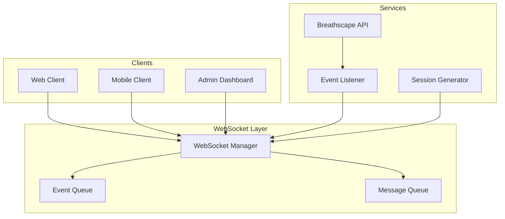
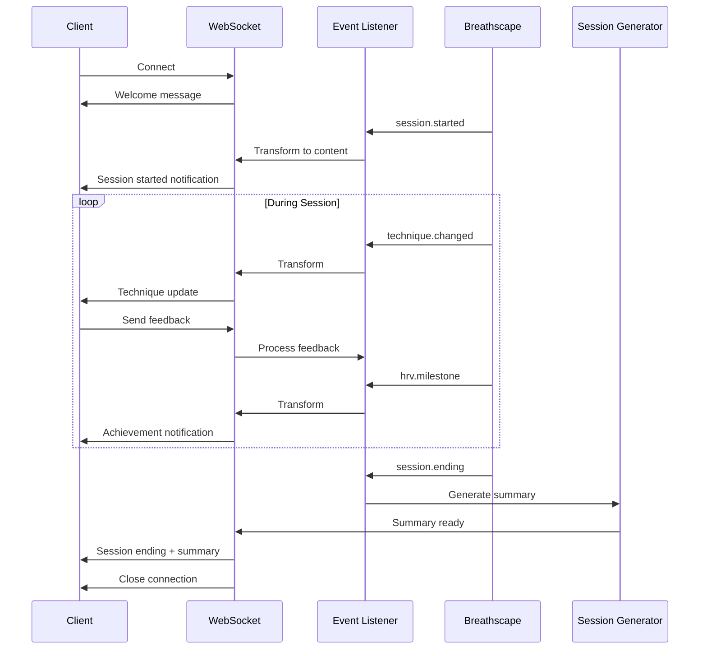

# WebSocket Integration Guide
**Sprint 3: Halcytone Live Support**

Complete guide for implementing and using WebSocket connections in the Halcytone platform.

## Table of Contents

1. [Architecture Overview](#architecture-overview)
2. [Client Implementation](#client-implementation)
3. [Server Components](#server-components)
4. [Event Flow](#event-flow)
5. [Security & Authentication](#security--authentication)
6. [Error Handling](#error-handling)
7. [Performance Optimization](#performance-optimization)
8. [Debugging & Monitoring](#debugging--monitoring)

## Architecture Overview

### Component Diagram



### Connection Types

| Role | Access Level | Capabilities |
|------|-------------|--------------|
| `participant` | Basic | Receive updates, send feedback |
| `instructor` | Enhanced | Control session, view metrics |
| `observer` | Read-only | View session without participation |
| `admin` | Full | All capabilities + system control |

## Client Implementation

### JavaScript/TypeScript Client

```typescript
// WebSocket connection manager
class SessionWebSocket {
    private ws: WebSocket | null = null;
    private reconnectAttempts = 0;
    private maxReconnectAttempts = 5;
    private reconnectDelay = 1000; // Start with 1 second
    private heartbeatInterval: NodeJS.Timeout | null = null;
    private messageQueue: any[] = [];
    private sessionId: string;
    private clientId: string;
    private role: string;

    constructor(sessionId: string, clientId: string, role: string = 'participant') {
        this.sessionId = sessionId;
        this.clientId = clientId;
        this.role = role;
    }

    connect(): Promise<void> {
        return new Promise((resolve, reject) => {
            const wsUrl = `ws://localhost:8000/ws/live-updates?session_id=${this.sessionId}&client_id=${this.clientId}&role=${this.role}`;

            try {
                this.ws = new WebSocket(wsUrl);

                this.ws.onopen = () => {
                    console.log('WebSocket connected');
                    this.reconnectAttempts = 0;
                    this.reconnectDelay = 1000;
                    this.startHeartbeat();
                    this.flushMessageQueue();
                    resolve();
                };

                this.ws.onmessage = (event) => {
                    this.handleMessage(JSON.parse(event.data));
                };

                this.ws.onerror = (error) => {
                    console.error('WebSocket error:', error);
                    reject(error);
                };

                this.ws.onclose = () => {
                    console.log('WebSocket disconnected');
                    this.stopHeartbeat();
                    this.attemptReconnect();
                };
            } catch (error) {
                reject(error);
            }
        });
    }

    private handleMessage(message: any): void {
        switch (message.type) {
            case 'welcome':
                this.onWelcome(message);
                break;
            case 'technique_changed':
                this.onTechniqueChanged(message);
                break;
            case 'hrv_milestone':
                this.onHRVMilestone(message);
                break;
            case 'participant_joined':
                this.onParticipantJoined(message);
                break;
            case 'session_ending':
                this.onSessionEnding(message);
                break;
            case 'error':
                this.onError(message);
                break;
            default:
                this.onCustomMessage(message);
        }
    }

    private startHeartbeat(): void {
        this.heartbeatInterval = setInterval(() => {
            this.send({ type: 'heartbeat' });
        }, 30000); // Every 30 seconds
    }

    private stopHeartbeat(): void {
        if (this.heartbeatInterval) {
            clearInterval(this.heartbeatInterval);
            this.heartbeatInterval = null;
        }
    }

    private attemptReconnect(): void {
        if (this.reconnectAttempts >= this.maxReconnectAttempts) {
            console.error('Max reconnection attempts reached');
            this.onMaxReconnectFailed();
            return;
        }

        this.reconnectAttempts++;
        console.log(`Reconnecting... Attempt ${this.reconnectAttempts}`);

        setTimeout(() => {
            this.connect().catch(error => {
                console.error('Reconnection failed:', error);
            });
        }, this.reconnectDelay);

        // Exponential backoff
        this.reconnectDelay = Math.min(this.reconnectDelay * 2, 30000);
    }

    send(message: any): void {
        if (this.ws && this.ws.readyState === WebSocket.OPEN) {
            this.ws.send(JSON.stringify(message));
        } else {
            // Queue message for later
            this.messageQueue.push(message);
        }
    }

    private flushMessageQueue(): void {
        while (this.messageQueue.length > 0 && this.ws?.readyState === WebSocket.OPEN) {
            const message = this.messageQueue.shift();
            this.ws.send(JSON.stringify(message));
        }
    }

    disconnect(): void {
        this.stopHeartbeat();
        if (this.ws) {
            this.ws.close();
            this.ws = null;
        }
    }

    // Event handlers (override in subclass)
    protected onWelcome(message: any): void {
        console.log('Session joined:', message);
    }

    protected onTechniqueChanged(message: any): void {
        console.log('Technique changed:', message.content);
    }

    protected onHRVMilestone(message: any): void {
        console.log('HRV milestone:', message.content);
    }

    protected onParticipantJoined(message: any): void {
        console.log('New participant:', message.content);
    }

    protected onSessionEnding(message: any): void {
        console.log('Session ending:', message);
    }

    protected onError(message: any): void {
        console.error('WebSocket error:', message);
    }

    protected onCustomMessage(message: any): void {
        console.log('Custom message:', message);
    }

    protected onMaxReconnectFailed(): void {
        console.error('Could not reconnect to session');
    }
}

// Usage example
class BreathingSessionClient extends SessionWebSocket {
    private uiController: UIController;

    constructor(sessionId: string, clientId: string, uiController: UIController) {
        super(sessionId, clientId, 'participant');
        this.uiController = uiController;
    }

    protected onTechniqueChanged(message: any): void {
        this.uiController.updateTechnique(
            message.content.title,
            message.content.instruction,
            message.content.duration
        );
    }

    protected onHRVMilestone(message: any): void {
        this.uiController.showAchievement(
            message.content.message,
            message.content.badge
        );
    }

    sendFeedback(technique: string, rating: number): void {
        this.send({
            type: 'technique_feedback',
            data: {
                technique,
                rating,
                timestamp: new Date().toISOString()
            }
        });
    }
}

// Initialize and connect
const client = new BreathingSessionClient('session-001', 'user-123', uiController);
await client.connect();
```

### React Hook Implementation

```typescript
// useSessionWebSocket.ts
import { useEffect, useRef, useState, useCallback } from 'react';

interface WebSocketOptions {
    sessionId: string;
    clientId: string;
    role?: string;
    onMessage?: (message: any) => void;
    onConnect?: () => void;
    onDisconnect?: () => void;
    onError?: (error: any) => void;
}

export function useSessionWebSocket(options: WebSocketOptions) {
    const [isConnected, setIsConnected] = useState(false);
    const [lastMessage, setLastMessage] = useState<any>(null);
    const wsRef = useRef<WebSocket | null>(null);
    const reconnectTimeoutRef = useRef<NodeJS.Timeout | null>(null);

    const connect = useCallback(() => {
        const { sessionId, clientId, role = 'participant' } = options;
        const wsUrl = `ws://localhost:8000/ws/live-updates?session_id=${sessionId}&client_id=${clientId}&role=${role}`;

        try {
            wsRef.current = new WebSocket(wsUrl);

            wsRef.current.onopen = () => {
                setIsConnected(true);
                options.onConnect?.();
            };

            wsRef.current.onmessage = (event) => {
                const message = JSON.parse(event.data);
                setLastMessage(message);
                options.onMessage?.(message);
            };

            wsRef.current.onerror = (error) => {
                options.onError?.(error);
            };

            wsRef.current.onclose = () => {
                setIsConnected(false);
                options.onDisconnect?.();

                // Attempt reconnect after 3 seconds
                reconnectTimeoutRef.current = setTimeout(() => {
                    connect();
                }, 3000);
            };
        } catch (error) {
            options.onError?.(error);
        }
    }, [options]);

    const sendMessage = useCallback((message: any) => {
        if (wsRef.current?.readyState === WebSocket.OPEN) {
            wsRef.current.send(JSON.stringify(message));
        }
    }, []);

    const disconnect = useCallback(() => {
        if (reconnectTimeoutRef.current) {
            clearTimeout(reconnectTimeoutRef.current);
        }
        if (wsRef.current) {
            wsRef.current.close();
            wsRef.current = null;
        }
    }, []);

    useEffect(() => {
        connect();
        return () => disconnect();
    }, [connect, disconnect]);

    return {
        isConnected,
        lastMessage,
        sendMessage,
        disconnect,
        reconnect: connect
    };
}

// Usage in component
function SessionView({ sessionId }: { sessionId: string }) {
    const [participants, setParticipants] = useState<string[]>([]);
    const [currentTechnique, setCurrentTechnique] = useState('');

    const { isConnected, sendMessage } = useSessionWebSocket({
        sessionId,
        clientId: getCurrentUserId(),
        role: 'participant',
        onMessage: (message) => {
            switch (message.type) {
                case 'participant_joined':
                    setParticipants(prev => [...prev, message.content.name]);
                    break;
                case 'technique_changed':
                    setCurrentTechnique(message.content.title);
                    break;
            }
        }
    });

    const sendFeedback = (rating: number) => {
        sendMessage({
            type: 'technique_feedback',
            data: { technique: currentTechnique, rating }
        });
    };

    return (
        <div>
            <ConnectionStatus connected={isConnected} />
            <TechniqueDisplay technique={currentTechnique} />
            <ParticipantList participants={participants} />
            <FeedbackControls onRate={sendFeedback} />
        </div>
    );
}
```

## Server Components

### WebSocket Manager Configuration

```python
# config/websocket_config.py
from pydantic import BaseSettings

class WebSocketConfig(BaseSettings):
    """WebSocket configuration settings"""

    # Connection settings
    max_connections_per_session: int = 100
    max_message_size: int = 65536  # 64KB
    ping_interval: int = 30  # seconds
    ping_timeout: int = 10  # seconds

    # Queue settings
    max_queue_size: int = 1000
    queue_ttl: int = 3600  # 1 hour

    # Reconnection settings
    allow_reconnection: bool = True
    reconnection_window: int = 300  # 5 minutes

    # Performance settings
    enable_compression: bool = True
    compression_level: int = 6

    # Security settings
    require_authentication: bool = True
    allowed_origins: list = [
        "http://localhost:3000",
        "https://app.halcytone.com"
    ]

    class Config:
        env_prefix = "WEBSOCKET_"
```

### Custom WebSocket Middleware

```python
# middleware/websocket_middleware.py
from fastapi import WebSocket, Query, HTTPException, status
from typing import Optional
import jwt
import logging

logger = logging.getLogger(__name__)

class WebSocketAuthMiddleware:
    """Authentication middleware for WebSocket connections"""

    def __init__(self, secret_key: str):
        self.secret_key = secret_key

    async def __call__(
        self,
        websocket: WebSocket,
        token: Optional[str] = Query(None),
        session_id: Optional[str] = Query(None)
    ) -> dict:
        """Authenticate WebSocket connection"""

        if not token:
            await websocket.close(code=status.WS_1008_POLICY_VIOLATION)
            raise HTTPException(
                status_code=status.HTTP_401_UNAUTHORIZED,
                detail="Authentication required"
            )

        try:
            # Verify JWT token
            payload = jwt.decode(token, self.secret_key, algorithms=["HS256"])
            user_id = payload.get("sub")
            role = payload.get("role", "participant")

            # Verify session access
            if not await self.verify_session_access(user_id, session_id, role):
                await websocket.close(code=status.WS_1008_POLICY_VIOLATION)
                raise HTTPException(
                    status_code=status.HTTP_403_FORBIDDEN,
                    detail="Access denied to session"
                )

            return {
                "user_id": user_id,
                "role": role,
                "session_id": session_id
            }

        except jwt.InvalidTokenError as e:
            logger.error(f"Invalid token: {e}")
            await websocket.close(code=status.WS_1008_POLICY_VIOLATION)
            raise HTTPException(
                status_code=status.HTTP_401_UNAUTHORIZED,
                detail="Invalid authentication token"
            )

    async def verify_session_access(
        self,
        user_id: str,
        session_id: str,
        role: str
    ) -> bool:
        """Check if user has access to session"""
        # Implement your session access logic here
        # Example: Check if user is registered for session
        # or if instructor owns the session
        return True  # Placeholder
```

### Rate Limiting

```python
# middleware/websocket_rate_limiter.py
from collections import defaultdict
from datetime import datetime, timedelta
import asyncio

class WebSocketRateLimiter:
    """Rate limiting for WebSocket messages"""

    def __init__(
        self,
        messages_per_minute: int = 60,
        burst_size: int = 10
    ):
        self.messages_per_minute = messages_per_minute
        self.burst_size = burst_size
        self.client_buckets = defaultdict(lambda: {
            'tokens': burst_size,
            'last_refill': datetime.now()
        })

    async def check_rate_limit(self, client_id: str) -> bool:
        """Check if client has exceeded rate limit"""
        bucket = self.client_buckets[client_id]
        now = datetime.now()

        # Refill tokens based on time passed
        time_passed = (now - bucket['last_refill']).total_seconds()
        tokens_to_add = (time_passed / 60) * self.messages_per_minute

        bucket['tokens'] = min(
            self.burst_size,
            bucket['tokens'] + tokens_to_add
        )
        bucket['last_refill'] = now

        if bucket['tokens'] >= 1:
            bucket['tokens'] -= 1
            return True

        return False

    async def cleanup_old_buckets(self):
        """Remove old buckets to prevent memory leak"""
        while True:
            await asyncio.sleep(300)  # Every 5 minutes
            cutoff = datetime.now() - timedelta(minutes=30)

            to_remove = [
                client_id for client_id, bucket in self.client_buckets.items()
                if bucket['last_refill'] < cutoff
            ]

            for client_id in to_remove:
                del self.client_buckets[client_id]
```

## Event Flow

### Session Lifecycle Events



### Custom Event Implementation

```python
# services/custom_events.py
from typing import Dict, Any, List
from datetime import datetime
import asyncio

class CustomEventProcessor:
    """Process custom application events"""

    def __init__(self, websocket_manager):
        self.ws_manager = websocket_manager
        self.event_handlers = {}
        self.register_handlers()

    def register_handlers(self):
        """Register custom event handlers"""
        self.event_handlers = {
            'breathing_sync': self.handle_breathing_sync,
            'group_achievement': self.handle_group_achievement,
            'instructor_message': self.handle_instructor_message,
            'technique_vote': self.handle_technique_vote
        }

    async def process_event(self, event: Dict[str, Any]):
        """Process custom event"""
        event_type = event.get('type')
        handler = self.event_handlers.get(event_type)

        if handler:
            await handler(event)
        else:
            await self.handle_unknown_event(event)

    async def handle_breathing_sync(self, event: Dict[str, Any]):
        """Handle breathing synchronization event"""
        session_id = event['session_id']
        sync_data = event['data']

        # Calculate group synchronization score
        sync_score = self.calculate_sync_score(sync_data)

        if sync_score > 0.8:  # 80% synchronized
            await self.ws_manager.broadcast_to_session(
                session_id,
                {
                    'type': 'group_sync_achieved',
                    'content': {
                        'title': 'Perfect Synchronization!',
                        'message': 'The group is breathing in perfect harmony',
                        'score': sync_score,
                        'visual': 'sync_celebration'
                    }
                }
            )

    async def handle_group_achievement(self, event: Dict[str, Any]):
        """Handle group achievement unlock"""
        achievement = {
            'type': 'achievement_unlocked',
            'content': {
                'title': event['data']['title'],
                'description': event['data']['description'],
                'badge': event['data']['badge_url'],
                'rarity': event['data']['rarity'],
                'celebration': True
            }
        }

        # Broadcast to all participants
        await self.ws_manager.broadcast_to_session(
            event['session_id'],
            achievement,
            roles=[ConnectionRole.PARTICIPANT, ConnectionRole.INSTRUCTOR]
        )

    async def handle_instructor_message(self, event: Dict[str, Any]):
        """Handle instructor broadcast message"""
        # Add instructor badge to message
        message = {
            'type': 'instructor_message',
            'content': {
                'from': event['data']['instructor_name'],
                'message': event['data']['message'],
                'priority': event['data'].get('priority', 'normal'),
                'timestamp': datetime.now().isoformat()
            }
        }

        await self.ws_manager.broadcast_to_session(
            event['session_id'],
            message,
            exclude_client=event.get('sender_id')
        )

    async def handle_technique_vote(self, event: Dict[str, Any]):
        """Handle technique voting"""
        session_id = event['session_id']

        # Update vote counts
        if not hasattr(self, 'vote_counts'):
            self.vote_counts = {}

        if session_id not in self.vote_counts:
            self.vote_counts[session_id] = {}

        technique = event['data']['technique']
        self.vote_counts[session_id][technique] = \
            self.vote_counts[session_id].get(technique, 0) + 1

        # Broadcast updated vote counts
        await self.ws_manager.broadcast_to_session(
            session_id,
            {
                'type': 'vote_update',
                'content': {
                    'votes': self.vote_counts[session_id],
                    'total_votes': sum(self.vote_counts[session_id].values())
                }
            }
        )
```

## Security & Authentication

### Token-Based Authentication

```python
# security/websocket_auth.py
from datetime import datetime, timedelta
import jwt
from fastapi import WebSocket, Query, status
from typing import Optional

class WebSocketAuthenticator:
    """WebSocket authentication handler"""

    def __init__(self, secret_key: str, algorithm: str = "HS256"):
        self.secret_key = secret_key
        self.algorithm = algorithm

    def generate_ws_token(
        self,
        user_id: str,
        session_id: str,
        role: str = "participant",
        expires_in: int = 3600
    ) -> str:
        """Generate WebSocket-specific token"""
        expiry = datetime.utcnow() + timedelta(seconds=expires_in)

        payload = {
            "sub": user_id,
            "session_id": session_id,
            "role": role,
            "exp": expiry,
            "iat": datetime.utcnow(),
            "type": "websocket"
        }

        return jwt.encode(payload, self.secret_key, algorithm=self.algorithm)

    async def authenticate_connection(
        self,
        websocket: WebSocket,
        token: Optional[str] = Query(None)
    ) -> Optional[dict]:
        """Authenticate WebSocket connection"""
        if not token:
            await websocket.close(
                code=status.WS_1008_POLICY_VIOLATION,
                reason="No authentication token provided"
            )
            return None

        try:
            payload = jwt.decode(
                token,
                self.secret_key,
                algorithms=[self.algorithm]
            )

            # Verify token type
            if payload.get("type") != "websocket":
                raise jwt.InvalidTokenError("Invalid token type")

            return payload

        except jwt.ExpiredSignatureError:
            await websocket.close(
                code=status.WS_1008_POLICY_VIOLATION,
                reason="Token expired"
            )
            return None

        except jwt.InvalidTokenError as e:
            await websocket.close(
                code=status.WS_1008_POLICY_VIOLATION,
                reason=f"Invalid token: {str(e)}"
            )
            return None
```

### CORS Configuration

```python
# config/cors_config.py
from fastapi import FastAPI
from fastapi.middleware.cors import CORSMiddleware

def configure_websocket_cors(app: FastAPI):
    """Configure CORS for WebSocket connections"""

    origins = [
        "http://localhost:3000",
        "http://localhost:8000",
        "https://app.halcytone.com",
        "https://breathscape.halcytone.com"
    ]

    app.add_middleware(
        CORSMiddleware,
        allow_origins=origins,
        allow_credentials=True,
        allow_methods=["GET", "POST"],
        allow_headers=["*"],
        expose_headers=["*"]
    )
```

## Error Handling

### Graceful Error Recovery

```python
# error_handling/websocket_errors.py
from enum import Enum
from typing import Optional
import logging

logger = logging.getLogger(__name__)

class WebSocketErrorCode(Enum):
    """WebSocket error codes"""
    CONNECTION_FAILED = 4000
    AUTHENTICATION_FAILED = 4001
    SESSION_NOT_FOUND = 4002
    SESSION_FULL = 4003
    RATE_LIMIT_EXCEEDED = 4004
    INVALID_MESSAGE = 4005
    SERVER_ERROR = 4006

class WebSocketErrorHandler:
    """Centralized error handling for WebSocket connections"""

    @staticmethod
    async def handle_error(
        websocket,
        error_code: WebSocketErrorCode,
        message: str,
        details: Optional[dict] = None
    ):
        """Send error to client and log"""
        error_response = {
            'type': 'error',
            'code': error_code.value,
            'message': message,
            'details': details or {}
        }

        try:
            await websocket.send_json(error_response)
        except Exception as e:
            logger.error(f"Failed to send error message: {e}")

        # Log error
        logger.error(
            f"WebSocket error {error_code.name}: {message}",
            extra={'details': details}
        )

        # Close connection for critical errors
        if error_code in [
            WebSocketErrorCode.AUTHENTICATION_FAILED,
            WebSocketErrorCode.SESSION_NOT_FOUND
        ]:
            await websocket.close(code=error_code.value, reason=message)

    @staticmethod
    def get_user_friendly_message(error_code: WebSocketErrorCode) -> str:
        """Get user-friendly error message"""
        messages = {
            WebSocketErrorCode.CONNECTION_FAILED:
                "Connection failed. Please try again.",
            WebSocketErrorCode.AUTHENTICATION_FAILED:
                "Authentication failed. Please log in again.",
            WebSocketErrorCode.SESSION_NOT_FOUND:
                "Session not found or has ended.",
            WebSocketErrorCode.SESSION_FULL:
                "Session is full. Please try again later.",
            WebSocketErrorCode.RATE_LIMIT_EXCEEDED:
                "Too many messages. Please slow down.",
            WebSocketErrorCode.INVALID_MESSAGE:
                "Invalid message format.",
            WebSocketErrorCode.SERVER_ERROR:
                "Server error. Our team has been notified."
        }
        return messages.get(error_code, "An error occurred.")
```

## Performance Optimization

### Connection Pooling

```python
# optimization/connection_pool.py
from typing import Dict, Set
import asyncio
from dataclasses import dataclass
from datetime import datetime

@dataclass
class ConnectionStats:
    """Track connection statistics"""
    connected_at: datetime
    messages_sent: int = 0
    messages_received: int = 0
    last_activity: datetime = None

    def update_activity(self):
        self.last_activity = datetime.now()

class ConnectionPool:
    """Efficient connection pooling"""

    def __init__(self, max_connections: int = 1000):
        self.max_connections = max_connections
        self.connections: Dict[str, Set] = {}
        self.stats: Dict[str, ConnectionStats] = {}
        self.lock = asyncio.Lock()

    async def add_connection(
        self,
        session_id: str,
        client_id: str,
        websocket
    ) -> bool:
        """Add connection to pool"""
        async with self.lock:
            if self.get_total_connections() >= self.max_connections:
                return False

            if session_id not in self.connections:
                self.connections[session_id] = set()

            self.connections[session_id].add((client_id, websocket))
            self.stats[client_id] = ConnectionStats(datetime.now())

            return True

    async def remove_connection(
        self,
        session_id: str,
        client_id: str
    ):
        """Remove connection from pool"""
        async with self.lock:
            if session_id in self.connections:
                self.connections[session_id] = {
                    conn for conn in self.connections[session_id]
                    if conn[0] != client_id
                }

                if not self.connections[session_id]:
                    del self.connections[session_id]

            if client_id in self.stats:
                del self.stats[client_id]

    def get_total_connections(self) -> int:
        """Get total number of connections"""
        return sum(len(conns) for conns in self.connections.values())

    def get_session_connections(self, session_id: str) -> int:
        """Get connections for a specific session"""
        return len(self.connections.get(session_id, set()))

    async def broadcast_optimized(
        self,
        session_id: str,
        message: dict,
        batch_size: int = 50
    ):
        """Optimized broadcast with batching"""
        connections = self.connections.get(session_id, set())

        # Split into batches for better performance
        batches = [
            list(connections)[i:i + batch_size]
            for i in range(0, len(connections), batch_size)
        ]

        for batch in batches:
            tasks = [
                self._send_message(client_id, ws, message)
                for client_id, ws in batch
            ]
            await asyncio.gather(*tasks, return_exceptions=True)

    async def _send_message(self, client_id: str, websocket, message: dict):
        """Send message and update stats"""
        try:
            await websocket.send_json(message)
            if client_id in self.stats:
                self.stats[client_id].messages_sent += 1
                self.stats[client_id].update_activity()
        except Exception as e:
            logger.error(f"Failed to send message to {client_id}: {e}")
```

### Message Compression

```python
# optimization/compression.py
import zlib
import json
from typing import Dict, Any

class MessageCompressor:
    """Compress large WebSocket messages"""

    def __init__(self, threshold: int = 1024, level: int = 6):
        self.threshold = threshold  # Compress if larger than this
        self.level = level  # Compression level (1-9)

    def compress_message(self, message: Dict[str, Any]) -> bytes:
        """Compress message if needed"""
        json_str = json.dumps(message)

        if len(json_str) > self.threshold:
            compressed = zlib.compress(
                json_str.encode('utf-8'),
                level=self.level
            )

            # Add compression header
            return b'COMPRESSED:' + compressed

        return json_str.encode('utf-8')

    def decompress_message(self, data: bytes) -> Dict[str, Any]:
        """Decompress message if needed"""
        if data.startswith(b'COMPRESSED:'):
            compressed_data = data[11:]  # Remove header
            json_str = zlib.decompress(compressed_data).decode('utf-8')
        else:
            json_str = data.decode('utf-8')

        return json.loads(json_str)
```

## Debugging & Monitoring

### WebSocket Inspector

```python
# debug/websocket_inspector.py
from datetime import datetime
from typing import Dict, List, Any
import json
import logging

class WebSocketInspector:
    """Debug and monitor WebSocket connections"""

    def __init__(self, enable_logging: bool = True):
        self.enable_logging = enable_logging
        self.message_history: List[Dict[str, Any]] = []
        self.connection_log: List[Dict[str, Any]] = []
        self.error_log: List[Dict[str, Any]] = []

        if enable_logging:
            self.logger = logging.getLogger(__name__)
            self.logger.setLevel(logging.DEBUG)

    def log_connection(
        self,
        event: str,
        session_id: str,
        client_id: str,
        details: Dict[str, Any] = None
    ):
        """Log connection event"""
        entry = {
            'timestamp': datetime.now().isoformat(),
            'event': event,
            'session_id': session_id,
            'client_id': client_id,
            'details': details or {}
        }

        self.connection_log.append(entry)

        if self.enable_logging:
            self.logger.info(f"Connection {event}: {json.dumps(entry)}")

    def log_message(
        self,
        direction: str,  # 'incoming' or 'outgoing'
        session_id: str,
        client_id: str,
        message: Dict[str, Any]
    ):
        """Log message for debugging"""
        entry = {
            'timestamp': datetime.now().isoformat(),
            'direction': direction,
            'session_id': session_id,
            'client_id': client_id,
            'message_type': message.get('type'),
            'message': message
        }

        self.message_history.append(entry)

        # Keep only last 1000 messages
        if len(self.message_history) > 1000:
            self.message_history = self.message_history[-1000:]

        if self.enable_logging:
            self.logger.debug(
                f"Message {direction} [{session_id}/{client_id}]: "
                f"{message.get('type')}"
            )

    def log_error(
        self,
        error: Exception,
        session_id: str = None,
        client_id: str = None,
        context: Dict[str, Any] = None
    ):
        """Log error for analysis"""
        entry = {
            'timestamp': datetime.now().isoformat(),
            'error_type': type(error).__name__,
            'error_message': str(error),
            'session_id': session_id,
            'client_id': client_id,
            'context': context or {}
        }

        self.error_log.append(entry)

        if self.enable_logging:
            self.logger.error(
                f"WebSocket error: {json.dumps(entry)}",
                exc_info=True
            )

    def get_session_metrics(self, session_id: str) -> Dict[str, Any]:
        """Get metrics for a specific session"""
        session_messages = [
            m for m in self.message_history
            if m['session_id'] == session_id
        ]

        session_connections = [
            c for c in self.connection_log
            if c['session_id'] == session_id
        ]

        return {
            'total_messages': len(session_messages),
            'incoming_messages': len([
                m for m in session_messages
                if m['direction'] == 'incoming'
            ]),
            'outgoing_messages': len([
                m for m in session_messages
                if m['direction'] == 'outgoing'
            ]),
            'unique_clients': len(set(
                m['client_id'] for m in session_messages
            )),
            'connection_events': len(session_connections),
            'errors': len([
                e for e in self.error_log
                if e.get('session_id') == session_id
            ])
        }

    def export_debug_data(self, filepath: str):
        """Export debug data for analysis"""
        debug_data = {
            'exported_at': datetime.now().isoformat(),
            'message_history': self.message_history[-500:],
            'connection_log': self.connection_log[-500:],
            'error_log': self.error_log[-100:],
            'summary': {
                'total_messages': len(self.message_history),
                'total_connections': len(self.connection_log),
                'total_errors': len(self.error_log)
            }
        }

        with open(filepath, 'w') as f:
            json.dump(debug_data, f, indent=2)
```

### Health Check Endpoint

```python
# monitoring/health_check.py
from fastapi import APIRouter
from datetime import datetime

router = APIRouter()

@router.get("/ws/health")
async def websocket_health(websocket_manager):
    """WebSocket service health check"""

    active_sessions = websocket_manager.get_active_sessions()

    health_data = {
        'status': 'healthy',
        'timestamp': datetime.now().isoformat(),
        'websocket_service': {
            'active_sessions': len(active_sessions),
            'total_connections': sum(
                websocket_manager.get_session_info(s)['participant_count']
                for s in active_sessions
            ),
            'uptime_seconds': websocket_manager.get_uptime(),
            'message_queue_size': websocket_manager.get_queue_size()
        },
        'performance': {
            'avg_message_latency_ms': websocket_manager.get_avg_latency(),
            'messages_per_second': websocket_manager.get_message_rate()
        }
    }

    return health_data

@router.get("/ws/metrics")
async def websocket_metrics(websocket_manager):
    """Detailed WebSocket metrics"""

    return {
        'sessions': [
            {
                'session_id': session_id,
                'participants': websocket_manager.get_session_info(session_id),
                'message_count': websocket_manager.get_message_count(session_id),
                'started_at': websocket_manager.get_session_start_time(session_id)
            }
            for session_id in websocket_manager.get_active_sessions()
        ],
        'global_stats': {
            'total_messages_sent': websocket_manager.total_messages_sent,
            'total_messages_received': websocket_manager.total_messages_received,
            'total_connections_made': websocket_manager.total_connections,
            'peak_concurrent_connections': websocket_manager.peak_connections
        }
    }
```

## Testing WebSocket Connections

### Integration Test Example

```python
# tests/test_websocket_integration.py
import pytest
import asyncio
from fastapi.testclient import TestClient
from websocket import create_connection
import json

@pytest.mark.asyncio
async def test_websocket_full_flow(test_client):
    """Test complete WebSocket session flow"""

    # Create WebSocket connection
    ws_url = "ws://localhost:8000/ws/live-updates"
    params = "?session_id=test-001&client_id=test-client&role=participant"

    ws = create_connection(ws_url + params)

    try:
        # Receive welcome message
        welcome = json.loads(ws.recv())
        assert welcome['type'] == 'welcome'
        assert welcome['session_id'] == 'test-001'

        # Send heartbeat
        ws.send(json.dumps({'type': 'heartbeat'}))

        # Receive heartbeat acknowledgment
        heartbeat_ack = json.loads(ws.recv())
        assert heartbeat_ack['type'] == 'heartbeat_ack'

        # Send technique feedback
        ws.send(json.dumps({
            'type': 'technique_feedback',
            'data': {
                'technique': 'Box Breathing',
                'rating': 5
            }
        }))

        # Receive feedback confirmation
        feedback_response = json.loads(ws.recv())
        assert feedback_response['type'] == 'feedback_received'

    finally:
        ws.close()
```

---

This integration guide provides everything needed to implement and maintain WebSocket connections in the Halcytone platform. Follow the patterns and examples to ensure reliable real-time communication.